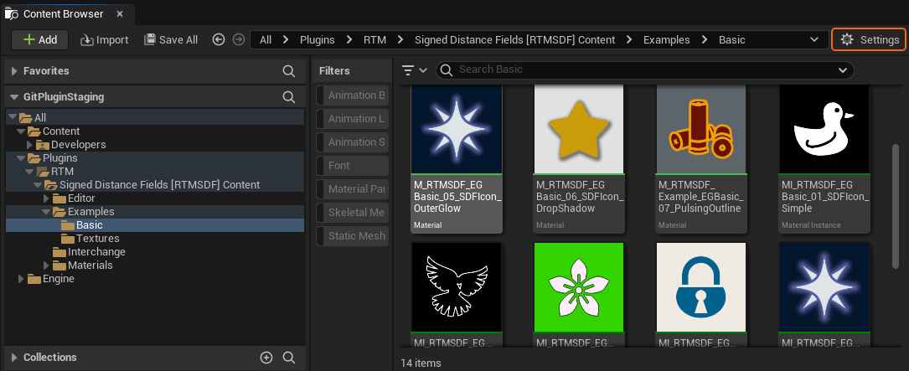
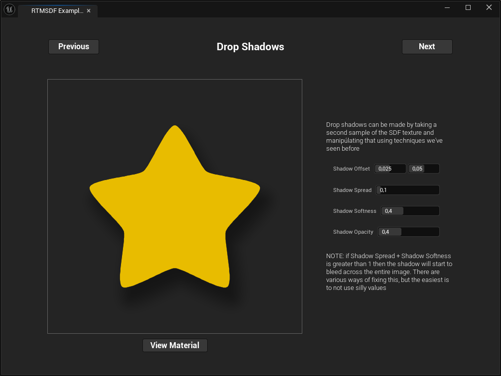

# SDF Examples

The plugin contains various examples of how to work with SDF textures, which you can find in the Content Browser under `All/Plugins/Signed Distance Fields [RTMSDF] Content/Examples/`. If you cannot see this directory check the content browser settings that `Show Plugin Content` is checked. There are also a small selection of SDF textures, used in these examples

## The Example Browser
The examples are now presented as an interactive pop-up window, which you can activate by finding the widget called `RUN_ME` in the examples foleder.

### Using the Examples Browser
The examples browser is quite simple to navigate. Each example has some tweakable settings that attempt to show some feature of SDFs. You can navigate between examples using the Next / Previous buttons, and can view the material used in the example by pressing the view material button at the bottom of the screen

### Notes on Examples Materials
The materials in these examples are intended for explaining concepts, and as such may not be ideal or fully optimised for production usage

## Textures
A small collection of textures that have been imported as SDFs. The source assets for these are included in `{PluginDir}/SourceAssets/Examples/Textures`

These textures are all from [Game-icons.net](https://game-icons.net/), created by Lorc and Delapouite

## Legacy Examples
In version 1.0.0 there were some examples that were just a collection of annotated materials and material interfaces. These have been moved to `Examples/Legacy/` but are considered to be superceded by the Examples browser