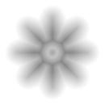
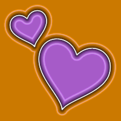
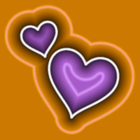
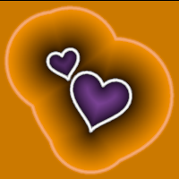

# Generating SDFs
The core of this plugin is the SDF Importers, one for [importing SVGs](./SVGs.md) and one for [importing bitmaps](./Bitmaps.md) (.png, .psd, .jpg, etc.)

## Common Concepts
## Importing Rules
The importers use filename suffixes to identify which source assets to import as SDF. By default this will mean that any suitable file with an `_SDF` suffix will be converted to SDF of import (eg, `T_MyIcon_SDF.png` or `T_MyIcon_SDF.svg`). This file naming rule will only be applied on the first import. Reimports of a file will check for the Settings object (see [Editing Generation Settings](#Editing-Generation-Settings) below)

You can customize these file suffixes in the `Project Settings`window under `Plugins > RTMSDF`
> NOTE: Future versions of the plugin should support custom filtering rules for import assets

## Editing Generation Settings
SDF textures are imported as standard `UTexture2D` assets, for maximum compatibility with other engine features, so the additional settings for controlling the import of an SDF are held in `AssetUserData` which is a little bit hidden by default

In the texture Editor for a texture that has been imported as SDF, find the SDF settings under `Texture > Advanced > Asset User Data` to edit generation settings 

> NOTE When you edit one of the settings here, you will need to manually trigger a reimport of the asset to see any changes.

## Editing Project Default Settings
You can set up default settings that will be applied to freshly imported source assets in `Project Settings` window under `Plugins > RTMSDF`. This can be used to ensure defaults that better suit your projects' needs and workflows

> NOTE: Future versions of the plugin should support custom rules for how to apply default settings

## Converting Between SDF and Non-SDF Textures
After first import, the settings object determines whether the texture should be imported as SDF or not, so it is possible to convert an SDF texture to a normal texture by removing the settings object, or converting to SDF by adding a settings object. In either case a reimport will be necessary

## Common Settings
These settings are shared between both types of importer. See the linked pages for settings specific to [importing SVGs](./SVGs.md) and [importing bitmaps](./Bitmaps.md) (.png, .psd, .jpg, etc.)

### Format
How the SDF will be encoded. Options are
- **Single Channel** - A traditional "true" SDF
- **Separate Channels** - an RGBA texture with separate SDFs in each channel (Bitmap source only)
- **Single Channel Pseudo** - A single channel SDF with sharp edges, similar to MSDF (SVG source only)
- **Multichannel** - an RGBA texture with an MSDF in RGB channels (SVG source only)
- **Multichannel Plus Alpha** - and RGBA texture with MSDF data in RGB and a true SDF in the Alpha (SVG source only)

> NOTE: On import, the texture's `Compression Settings` will be overridden with the most appropriate setting for the SDF Format selected. As SDFs require uncompressed texture data, there is no need to manually edit `Compression Settings`

### Texture Size
The size of the output texture's shortest dimension

As SDFs can often be smaller than the source assets they represent, texture size is customizable. The aspect ratio of the source texture will remain, for example
- A 512x512 source asset with `Texture Size` of 64 will produce a 64x64 SDF texture
- A 256x1024 source asset with `Texture Size` of 64 will produce a 64x256 SDF texture
- A 1024x256 source asset with `Texture Size` of 64 will produce a 256x64 SDF texture

> NOTE: `Texture Size` will be ignored unless all of the target channels contain SDF (or no) data.See [Importing SDFs from Bitmaps](./Bitmaps.md).

### Distance Mode and Distance
This determines how far the distance field will exend beyond the edge of the shape. In all cases this is the ± range so the total distance field will be twice as long. The following modes are supported
- **Normalized** - Normalized against source file (shortest edge). This is recommended as it will give consistent results if you change the source or target resolution of the data
- **Absolute** - Range in the source file. i.e. if the source file 512px and `Absolute Distance` is 64, this is equivalent to a normalized range of 0.125
- **Pixels** - Range in the target SDF. i.e. if the `Texture Size` is 64px and `Pixel Distance` range is 8, this is equivalent to a normalized range of 0.125

### Invert Distance
By default, textues are imported with a distance field encoded with 0 at the innermost position of the field (inside the shape) and 1 at the outermost point of the field. You can invert this, whcih may make it slightly easier to see what shape the distance field represents. However, it's still not that easy to discern the source shape from the SDF, so it is recomended to use the asset thumbnail renders for that

 &nbsp;  &nbsp; 

*Examples of Non-Inverted (center) and Inverted (right) Distance Field textures, alongside source shape (left)*

### Scale to Fit Distance
If true, the resulting SDF will scaled so that the full distance field is contained within the texture. This is useful as it means you do not need to author margins into your source files.

 &nbsp;  &nbsp;  &nbsp; 

*Examples of SDFs with normalized distance ranges of 0.05, 0.125 and 0.25 (left to right, source image leftmost)*

> NOTE: `Scale to Fit Distance` cannot be used unless all of the target channels contain SDF (or no) data. See [Importing SDFs from Bitmaps](./Bitmaps.md).

> NOTE: for MSDF (**Multichannel**) and **Single Channel Pseudo**  formats it is not guaranteed that the full distance field will be contained inside the resulting texture. If you wish to use the full distance field of an MSDF texture it is recommended that you either
> - Manually author the required ranges in the source asset, or
> - Generate your SDF with **Multichannel Plus Alpha** format. Use the MSDF for the surface of the shape and true SDF for and glow / shadow / other features using the full distance field. The true SDF will be guaranteed to fit using *Scale to Fit Distance* and is likely to give better results for those effects
>
> See [Importing SDFs from SVGs](./SVGs.md)

## Common Cached Data
On import the import will also cache out some data that may be useful at runtime. These values can be accessed via the [Blueprint Function Library](../Runtime/BlueprintFunctionLibrary.md)

### UV Range
This is effectively the same as the Normalized Distance of the generated distance field. It is useful for scaling certain effects to match varing distance field ranges

## Source Dimensions
The dimensions, in pixels, of the source asset used to create this SDF. Useful to know as the resultand SDF may be a different size