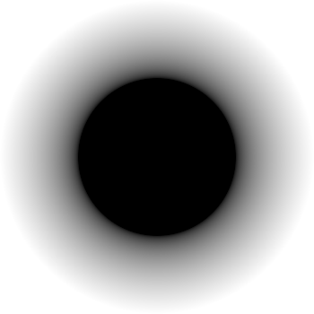
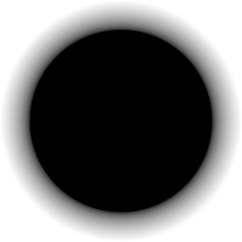

# SDF Texture Processing Functions

Functions for processing SDF texture data. These functions are designed to work with the SDF and MSDF textures that are generated by this Plugin and act as a bridge between imported texture data and standard SDF workflows

## Process SDF Texture
> `/RTMSDF/Materials/MaterialFunctions/TextureProcessing/MF_RTMSDF_SDF_Convert`

|  |  |
|-|-|

Takes a single channel SDF texture and converts it to a signed distance field in the range -1 to 1

This function is generally the first step you would take when working with an SDF texture asset. SDF textures can only hold values from 0 to 1, so they encode the distance field in that range, with a value of 0.5 marking the edge of the shape. To create a *signed* distance field in materials, this function remaps the tecture value to -1 to 1, so that a value of 0 now marks the edge of the shape

### Inputs:

| **Input&nbsp;Name** | **Type** | **Required** | **Description** |
|-|-|-|-|
| **SDFTexture** | Scalar | ✓ | Texture data from a single channel SDF texture, in the range 0-1 |

### Outputs:

| **Output** | **Output&nbsp;Name** | **Description** |
|-|-|-|
|  | **SDF** | A single channel signed distance field in the range -1 to 1, with the edge of the shape being where the pixels have zero value |
|  | **Inverted** | An inverted version of the SDF. For use if the texture was imported using the `Invert Distance` option |

## MSDF Channel Median
> `/RTMSDF/Materials/MaterialFunctions/TextureProcessing/MF_RTMSDF_MSDF_Median`

|  |  |
|-|-|

Takes MSDF data and converts it to a pseudo distance field in the range 0-1 by calculating  the median of the 3 channels

It is unlikely that you will need to use this function directly all that often, as the `Process MSDF Texture` function should do what you need. However it is included in the library as it may be useful in some specfic use cases

### Inputs:

| **Input&nbsp;Name** | **Type** | **Required** | **Description** |
|-|-|-|-|
| **MSDF_Texture** | Vector3 | ✓ | Raw RGB values from an MSDF texture |

### Outputs:

| **Output&nbsp;Name** | **Description** |
|-|-|
| **Result** | The median of the three RBG channels. For an MSDF texture, this will be the equvalent of a Pseudo-SDF texture asset |

## Process MSDF Texture
> `/RTMSDF/Materials/MaterialFunctions/TextureProcessing/MF_RTMSDF_MSDF_Convert`

|  |  |
|-|-|

Takes MSDF texture data and converts it to a signed distance field in the range -1 to 1

This function is similar to the `Process SDF Texture` function, and wiil generally the first step you would take when working with an MSDF texture asset. It takes the median of the RGB channels and then remaps tthe value to the range -1 to 1

### Inputs:

| **Input&nbsp;Name** | **Type** | **Required** | **Description** |
|-|-|-|-|
| **MSDFTexture** | Vector3 | ✓ | Raw RGB values from an MSDF texture |

### Outputs:

| **Output&nbsp;Name** | **Description** |
|-|-|
| **SDF** | A single channel signed distance field in the range -1 to 1, with the edge of the shape being where the pixels have zero value |
| **Inverted** | An inverted version of the SDF. For use if the texture was imported using the `Invert Distance` option |

## SDF Texture to Edge Mask
> `/RTMSDF/Materials/MaterialFunctions/TextureProcessing/MF_RTMSDF_SDF_TextureEdgeMask`

|  |  |
|-|-|

Takes a single channel SDF texture and creates an edge mask for the shape

This function provides a simple solution for when you just need to reproduce a shape from an SDF Texture and do not need to do any additional fancy effects. The resulting mask will be anti-aliased at any zoom level and the AA should handle distortion well (e.g. skew or UVs manipulated by a noise function)

### Inputs:

| **Input&nbsp;Name** | **Type** | **Required** | **Description** |
|-|-|-|-|
| **SDFTexture** | Scalar | ✓ | Texture data from a single channel SDF texture, in the range 0-1 |

### Outputs:

| **Output** | **Output&nbsp;Name** | **Description** |
|-|-|-|
|  | **EdgeMask** | An mask that represents the shape encoded in the SDF |
|  | **Inverted** | An inverted mask. For use if the texture was imported using the `Invert Distance` option |

## MSDF Texture to Edge Mask
> `/RTMSDF/Materials/MaterialFunctions/TextureProcessing/MF_RTMSDF_MSDF_TextureEdgeMask`

|  |  |
|-|-|

Takes MSDF texture data and creates an edge mask for the shape

This function provides a simple solution for when you just need to reproduce a shape from an SDF Texture and do not need to do any additional fancy effects. The resulting mask will be anti-aliased at any zoom level and the AA should handle distortion well (e.g. skew or UVs manipulated by a noise function)

### Inputs:

| **Input&nbsp;Name** | **Type** | **Required** | **Description** |
|-|-|-|-|
| **MSDFTexture** | Vector3 | ✓ | Raw RGB values from an MSDF texture |

### Outputs:

| **Output** | **Output&nbsp;Name** | **Description** |
|-|-|-|
|  | **EdgeMask** | An mask that represents the shape encoded in the MSDF |
|  | **Inverted** | An inverted mask. For use if the texture was imported using the `Invert Distance` option |

## FWidth [RTMSDF]
> `/RTMSDF/Materials/MaterialFunctions/InternalHelpers/MF_RTMSDF_DefaultFWidth`

Computes filterwidth

Two versions of FWidth are provided here. The `Manhattan` version is the commonly used `abs(ddx(p)) + abs(ddy(p))`. This can lead to larger values on diagonals, so the Euclidean version (`√(ddx(p)² + ddy(p)²)`) may be preferable for greater accuracy, at an additional cost
> NOTE: The built-in `ComputeFilterWidth` is fine but wants a Vector3 input and we're typically dealing with scalars

### Inputs:

| **Input&nbsp;Name** | **Type** | **Required** | **Description** |
|-|-|-|-|
| **SDF** | Scalar | ✓ |  |

### Outputs:

| **Output&nbsp;Name** | **Description** |
|-|-|
| **Euclidean** | A more expensive version of FWidth that uses a square root to calculate a more accurate derivative |
| **Manhattan** | A cheaper and more common form of FWidth. This can be fine but will give larger values on diagonals |

## SDF UV Scale Factor
> `/RTMSDF/Materials/MaterialFunctions/TextureProcessing/MF_RTMSDF_UVScaleFactor`

Takes the UVRange of an SDF texture and returns a scaling factor to offset the shrinking that occurs during import

UVRange can be found for a given texture by checking the cached data in it's import settings or by using the Blueprint Function Libarary function `Get UV Range`. Alternatively, you can scale your SDF widgets using the RenderTransform in UMG. The Blueprint Library function `Get SDF Scaling Factor` can be used to calculate the appropriate RenderScale to use

### Inputs:

| **Input&nbsp;Name** | **Type** | **Required** | **Description** |
|-|-|-|-|
| **UVRange** | Scalar | ✓ | The UVScale of the SDF texture |

### Outputs:

| **Output&nbsp;Name** | **Description** |
|-|-|
| **Result** | Scaling factor for UV coordinates to scale the SDF back to the size of the source asset |

