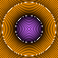
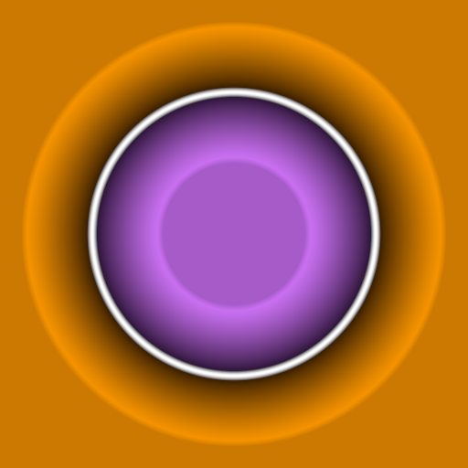

# SDF Visualization Functions

Visualization functions for SDFs

## IQ SDF Visualizer
> `/RTMSDF/Materials/MaterialFunctions/Visualizers/MF_RTMSDF_IQ_DistanceVisualizer`

 

Function for visualizing distance fields, based upon the pattern popularised by Inigo Quilez (IQ on shadertoy)

| **Input Name** | **Type** | **Description** |
|-|-|-|
| **SDF** | Scalar | The distance field to display|
| **PositiveColor** | Vector3 | Base color for the positive portion of the SDF|
| **NegativeColor** | Vector3 | Base color for the negative portion of the SDF|
| **StrokeWidth** | Scalar | Width of the stroke at the surface of the object (distance = 0). Width is in in distance field units|
| **UnitDistanceLineWidth** | Scalar | Width of the line marking the distance exactly 1 distance unit away from the surface|
| **IsolineScale** | Scalar | How many isolines to show per unit distance|
| **IsolineIntensity** | Scalar | How many isolines to show per unit distance|
| **UVs** | Vector2 | (optional) if specified will be used to mark the origin and axes of the UV space. This can be useful for understanding how various SDF shapes are being defined|
|

| **Output** | **Output Name** | **Description** |
|-|-|-|
|  | **Result** |  |
|

## IQ SDF Visualizer (Textures)
> `/RTMSDF/Materials/MaterialFunctions/Visualizers/MF_RTMSDF_IQ_TextureDistanceVisualizer`

 

Function for visualizing distance fields from textures. This version is simplified to work better with generated SDF textures that have finite fields

> NOTE: While this visualizer is intended to work with textures, it still expects the input to have been processed into a signed distance field, in the range -1 to 1, rather than raw texture data, in the range 0 to 1. Use one of the `Process SDF Texture` or `Process MSDF Texture` material functions on your texture data before passing to this function

| **Input Name** | **Type** | **Description** |
|-|-|-|
| **SDF** | Scalar | Distance in the range -1 to 1|
| **PositiveColor** | Vector3 | Base color for the positive portion of the SDF|
| **NegativeColor** | Vector3 | Base color for the negative portion of the SDF|
| **StrokeWidth** | Scalar | Width of the stroke at the surface of the object (distance = 0). Width is in in distance field units|
| **InnerDistanceIntensity** | Scalar | How strong the inner darkening effect is|
|

| **Output** | **Output Name** | **Description** |
|-|-|-|
|  | **Result** |  |
|

