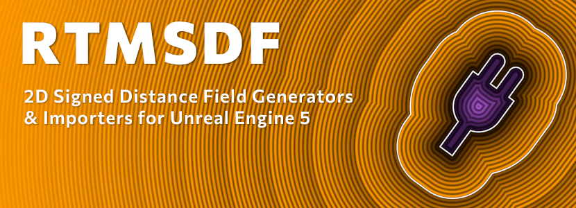
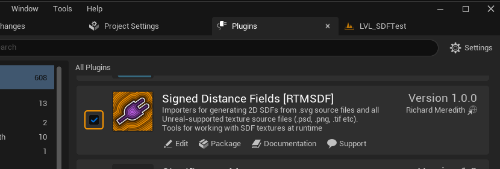
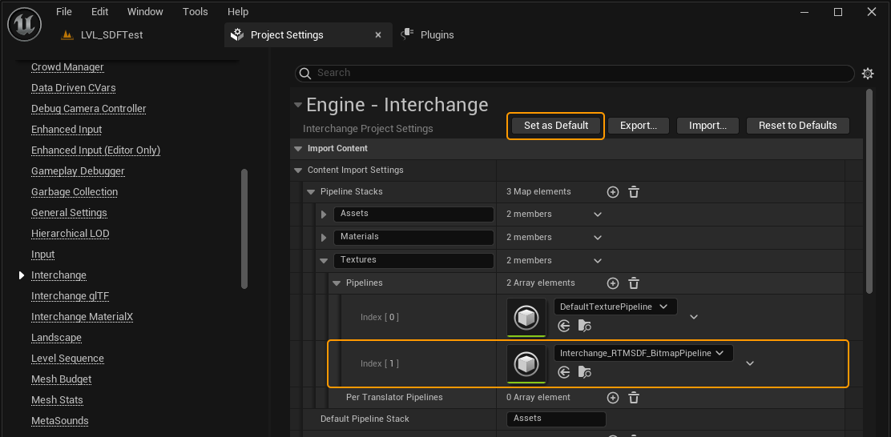
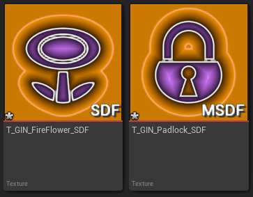

# RTMSDF v1.0.0
An Unreal Engine 5 Plugin that provides importers for generating 2D SDFs from .svg 
source files and all Unreal-supported texture source files (.psd, .png, .tif etc). 
Uses [MSDFGen](https://github.com/Chlumsky/msdfgen) for processing of SVG files. 
Currently supports UE5.4+

See [Changelog](CHANGELOG.md) for details of what is new in version 1.0.

## Downloading from GitHub
Either clone this repository or download one of the pre-built binary releases and add it
to either `{Project}/Plugins/RTMSDF/` or `{Engine}/Plugins/RTMSDF/` directory

> Note: the cloned repository will not have binaries included, so you will need to build
them yourself in a cpp project. Blueprint only projects will need to take the latest version
from Releases

## Quick Start
### 1. Enable the Plugin
Enable the plugin, either by manually adding it to your `.uproject` file, or in editor via the Plugins window:
1. Choose `Edit > Plugins` from the top menu bar
2. Find the plugin called **Signed Distance Fields [RTMSDF]** or search "RTMSDF"
3. Check the box to the left of the icon
4. Restart the editor

### 2. Configure Interchange
Configure Interchange to be add the importers to the texture pipeline
1. Choose `Edit > Project Settings` from the top menu bar
2. Find `Engine > Interchange` in the side bar (do *NOT* search for it)
3. Under `Import Content > Content Import Settings > Pipeline Stacks` find `Textures` and add a new element to the `Pipelines` array
4. Select `Interchange_RTMSDF_BitmapPipeline`. 
    - If you cannot see it it the drop down, check the plugin is enabled and that you have `Show Plugin Content` checked in the Asset Picker ⚙️Settings 
5. Click `Set as Default`in the top right of the window. 
   - If you can't see this button, check that you found the Interchange via the side bar and not by searching

> NOTE: Interchange settings are per-user, so if you are working on a team it is important to `Set as Defaults` and commit the `DefaultEngine.ini` file to VCS

### 3. Import Your First SDFs
Start by trying to import one of the example assets
1. Navigate to the folder with `RTMSDF.uplugin` in
2. Find the `SourceAssets/Examples/Textures/` subdirectory
3. Drag one of the .png files and one of the .svg files into your content browser
4. The thumbnails should look similar to the ones below (orange/purple, with "SDF" or "MSDF" in the corner)
    - If they don't show up like that, double check the Plugin and interchange settings, or contact me via [Bluesky](https://bsky.app/profile/rtm223.me), [Mastodon](https://mastodon.gamedev.place/@rtm223) or [email](mailto:hello@richardmeredith.net)
    - Hopefully there will be a troubleshooting guide available soon

## Further Reading
Check out the [Docs](Docs/Index.md) for more info. Recommended next steps are
  - [Generation](Docs/Generation/Index.md) - to find out more about generating SDFs and import options
  - [Examples](Docs/Examples/Index.md) to see some of the effects you can create with SDF textures